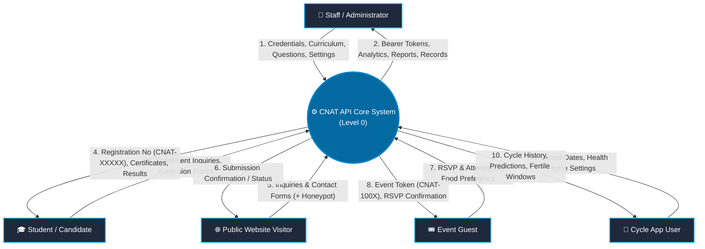
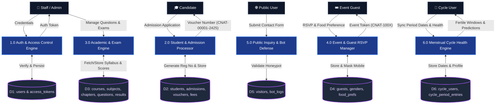
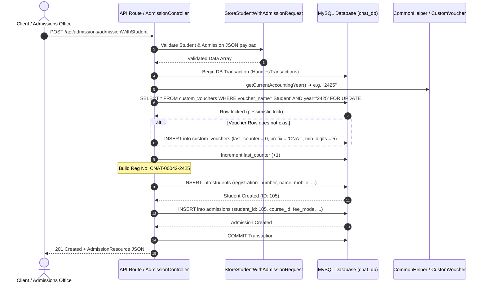
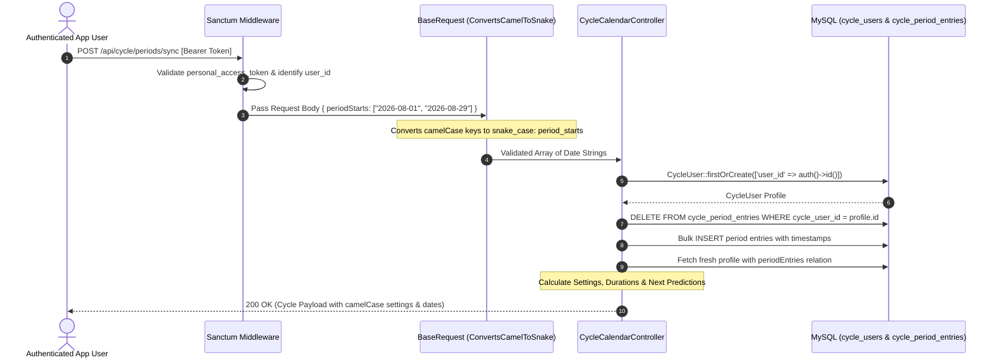

# CNAT API — Comprehensive System Documentation & Architecture Guide

> **Version:** 2.0 • **Framework:** Laravel 11.x (PHP 8.2+) • **Database:** MySQL 8.x  
> **Author:** Antigravity Engineering • **Date:** September 2026  
> **Visual Diagram Asset:** [`api_architecture_dfd.svg`](file:///e:/wamp64/www/cnat_api/api_architecture_dfd.svg)

---

## 1. System Overview & Architectural Structure

The **CNAT API** (`cnat_api`) is a centralized backend service providing core academic enterprise resource planning (ERP), candidate assessment, student lifecycle tracking, event management, and personal health tracking micro-services.

### Technology Stack
* **Framework:** Laravel 11.x
* **Language Runtime:** PHP 8.2+
* **Authentication Engine:** Laravel Sanctum (Personal Access Tokens)
* **Relational Database:** MySQL 8.x (`cnat_db`)
* **Web Server:** Apache (WAMP Environment)
* **API Paradigm:** RESTful JSON API with Form Request validation, custom exception rendering, and API Resources.

### Architectural Layering

```
┌─────────────────────────────────────────────────────────────────────────────┐
│                       Client Layer (Web / Mobile / SPA)                     │
│               React SPA, Administrative Dashboard, Mobile Apps              │
└──────────────────────────────────────┬──────────────────────────────────────┘
                                       │ HTTP / HTTPS (JSON)
                                       ▼
┌─────────────────────────────────────────────────────────────────────────────┐
│                     Routing & Middleware Pipeline                           │
│  • CORS Handler (`HandleCors`)          • Rate Limiter (`throttle:3,1`)     │
│  • Sanctum Guard (`auth:sanctum`)        • CSRF Bypass for `api/*`           │
└──────────────────────────────────────┬──────────────────────────────────────┘
                                       │
                                       ▼
┌─────────────────────────────────────────────────────────────────────────────┐
│                      Request Validation Layer                               │
│  • `BaseRequest` (CamelCase ➔ SnakeCase converter)                          │
│  • Specialized FormRequests (`StoreStudentRequest`, `UpdateCycleUserRequest`) │
│  • Standardized 422 JSON payload on validation failure                      │
└──────────────────────────────────────┬──────────────────────────────────────┘
                                       │ Validated Data ($request->validated())
                                       ▼
┌─────────────────────────────────────────────────────────────────────────────┐
│                         Controller & Domain Layer                           │
│  • RESTful Action Handlers                                                  │
│  • `HandlesTransactions` Trait (Auto-rollback & Audit Logging)              │
│  • Business Rules (Voucher numbering, Honeypot detection, Cycle math)       │
└──────────────────────────────────────┬──────────────────────────────────────┘
                                       │
                                       ▼
┌─────────────────────────────────────────────────────────────────────────────┐
│                   Data Persistence & Transformer Layer                      │
│  • Eloquent Models (Relationships, Casts, Mutators)                         │
│  • API Resources (`GuestResource`, `StudentResource`, `AdmissionResource`)  │
│  • Standardized Response (`ResponseHelper` & `ApiResponse` Trait)           │
└──────────────────────────────────────┬──────────────────────────────────────┘
                                       │ PDO Queries
                                       ▼
┌─────────────────────────────────────────────────────────────────────────────┐
│                         Database (MySQL - cnat_db)                          │
│  • Academic Entities    • Financials & Vouchers   • Menstrual Cycle Logs   │
│  • Examination Bank    • Event Guests            • Visitors & Bot Logs     │
└─────────────────────────────────────────────────────────────────────────────┘
```

---

## 2. Data Flow Diagrams (DFD)

### 2.1 DFD Level 0 — System Context Diagram
The Level 0 Context Diagram depicts the boundaries of the CNAT API system, showing interactions between external actors and the core engine.



---

### 2.2 DFD Level 1 — Major Subsystems & Data Stores
The Level 1 DFD decomposes the system into its 6 core functional subsystems and their corresponding database data stores.



---

### 2.3 DFD Level 2 — Detailed Subsystem Flows

#### A. Subsystem 2.0: Student Admission & Custom Voucher Generation Flow
This detailed flow illustrates how the system ensures thread-safe, gapless registration numbering using pessimistic database locking (`lockForUpdate`).



---

#### B. Subsystem 6.0: Menstrual Cycle Tracking & Synchronization Flow
Illustrates how camelCase requests from frontend apps (React/Flutter) are converted to snake_case, verified, and mapped to predictions.



---

## 3. Role-Based Access Control (RBAC) Architecture

The system enforces a **One User, One Role** architecture. Every user has exactly one `user_type_id` referencing the `user_types` table.

### 3.1 Role Hierarchy & Tiers
| Tier | Authorized Roles | Access Scope |
| :--- | :--- | :--- |
| **Tier 1: Administration** | `Admin`, `Developer`, `Owner` | Full system access, staff/employees, departments, role definitions. |
| **Tier 2: Academic Staff** | `Admin`, `Developer`, `Owner`, `Manager`, `Teacher` | Students, admissions, courses, curriculum (subjects/chapters/topics), exams (questions/options/results), receipts. |
| **Tier 3: Events & Operations**| `Admin`, `Developer`, `Owner`, `Manager`, `Manager Sale` | Guest invitations, RSVPs, attendance, and visitor inquiries. |
| **Self-Service / Personal** | *Any Authenticated User* | Profile retrieval (`/api/me`), token logout, and personal Menstrual Cycle Calendar. |

### 3.2 Enforcement Mechanism
- **Model Layer**: [`User::hasRole($roles)`](file:///e:/wamp64/www/cnat_api/app/Models/User.php) verifies roles with case-insensitivity and whitespace trimming. Convenient helpers include `$user->role_name` and `$user->isAdmin()`.
- **Middleware Layer**: [`App\Http\Middleware\CheckRole`](file:///e:/wamp64/www/cnat_api/app/Http/Middleware/CheckRole.php) intercepts requests. If unauthorized, returns **HTTP 403 Forbidden**:
  ```json
  {
    "status": false,
    "message": "Forbidden: This action requires the [Admin, Developer, Owner] role.",
    "data": null,
    "userRole": "Teacher"
  }
  ```
- **Registration**: Registered as `'role'` in [`bootstrap/app.php`](file:///e:/wamp64/www/cnat_api/bootstrap/app.php).
- **Frontend Contract**: [`UserResource`](file:///e:/wamp64/www/cnat_api/app/Http/Resources/UserResource.php) directly returns `'role' => 'Admin'`.

---

## 4. Detailed API Endpoint Catalog

All routes reside under `/api` and return standardized JSON responses.

### 4.1 Authentication & User Roles (`/api`)
| Method | URI | Auth & Role | Controller & Method | Description |
| :--- | :--- | :---: | :--- | :--- |
| `POST` | `/register` | Public | `Api\AuthController@register` | Registers new user account with employee relation. |
| `POST` | `/login` | Public (`name:login`) | `Api\AuthController@login` | Validates credentials; issues Sanctum Bearer token. |
| `GET` | `/me` | Any Authenticated | `Api\AuthController@getCurrentUser` | Returns current user profile with direct `role` attribute. |
| `GET` | `/me2` | Any Authenticated | `Api\AuthController@getCurrentUser2` | Returns raw authenticated user object. |
| `POST` | `/logout` | Any Authenticated | `Api\AuthController@logout` | Revokes current active access token. |
| `GET` | `/revokeAll` | Any Authenticated | `Api\AuthController@revoke_all` | Revokes all issued tokens for the authenticated user. |
| `GET` | `/user-types` | `role:Admin,Developer,Owner` | `UserTypeController@index` | Lists all 7 available roles in the system. |

---

### 3.2 Students & Admissions (`/api/students`, `/api/admissions`)
| Method | URI | Auth | Controller & Method | Description |
| :--- | :--- | :---: | :--- | :--- |
| `GET` | `/students` | Sanctum | `StudentController@index` | Lists all registered students. |
| `POST` | `/students` | Sanctum | `StudentController@store` | Creates student with auto-generated registration number. |
| `POST` | `/students/basic` | Sanctum | `StudentController@storeBasic` | Fast-track student creation with minimal fields. |
| `GET` | `/students/{student}` | Sanctum | `StudentController@show` | **Requires Implementation.** |
| `PUT` | `/students/{student}` | Sanctum | `StudentController@update` | Updates student bio and contact info. |
| `GET` | `/students/without-admission` | Sanctum | `StudentController@studentsWithoutAdmission` | Lists enrolled students not yet linked to any course. |
| `GET` | `/students/{student}/admissions` | Sanctum | `StudentController@admissions` | Eager-loads student's admission history and courses. |
| `GET` | `/admissions` | Sanctum | `AdmissionController@index` | Lists admissions with course and status relations. |
| `POST` | `/admissions` | Sanctum | `AdmissionController@store` | Enrolls an existing student into a course. |
| `POST` | `/admissions/admissionWithStudent`| Sanctum | `AdmissionController@storeStudentWithAdmission` | **Atomic composite transaction**: creates both student & admission. |
| `GET` | `/admissions/{admission}` | Sanctum | `AdmissionController@show` | **Requires Implementation.** |
| `PUT` | `/admissions/{admission}` | Sanctum | `AdmissionController@update` | Updates admission status, dates, or fees. |
| `DELETE` | `/admissions/{admission}`| Sanctum | `AdmissionController@destroy` | Deletes an admission entry. |

---

### 3.3 Menstrual Cycle Calendar Micro-service (`/api/cycle`)
| Method | URI | Auth | Controller & Method | Description |
| :--- | :--- | :---: | :--- | :--- |
| `GET` | `/cycle/me` | Sanctum | `CycleCalendarController@me` | Loads or auto-creates user's cycle health profile. |
| `PUT` | `/cycle/me` | Sanctum | `CycleCalendarController@updateProfile` | Updates cycle settings (durations, goal, luteal phase). |
| `POST` | `/cycle/period` | Sanctum | `CycleCalendarController@addPeriodDate` | Adds a single period start date. |
| `PUT` | `/cycle/period/{date}` | Sanctum | `CycleCalendarController@editPeriodDate` | Updates a recorded start date or entry note. |
| `DELETE` | `/cycle/period/{date}` | Sanctum | `CycleCalendarController@deletePeriodDate` | Removes a recorded period date. |
| `POST` | `/cycle/periods/sync` | Sanctum | `CycleCalendarController@syncPeriodDates` | Bulk replaces period history from an array. |
| `DELETE`| `/cycle/periods` | Sanctum | `CycleCalendarController@clearAllPeriods` | Clears all recorded dates while preserving profile. |

---

### 3.4 Curriculum & Examination Bank (`/api/subjects`, `/api/chapters`, `/api/topics`, `/api/questions`)
| Method | URI | Auth | Controller & Method | Description |
| :--- | :--- | :---: | :--- | :--- |
| `GET` | `/subjects` | Sanctum | `SubjectController@index` | Lists all academic subjects. |
| `GET` | `/subjects/unused` | Sanctum | `SubjectController@unused_subjects` | Lists subjects with no chapters attached. |
| `GET` | `/subjects/{subject}/chapters` | Sanctum | `SubjectController@list_of_chapters_in_subjects` | Lists all chapters under a subject. |
| `GET` | `/chapters/{chapter}/topics` | Sanctum | `ChapterController@list_of_topics_in_chapters` | Lists all topics under a chapter. |
| `GET` | `/topics/{topic}/questions` | Sanctum | `TopicController@list_of_questions_in_topics` | Lists all questions assigned to a topic. |
| `apiResource`| `/questions` | Sanctum | `QuestionController` | Full CRUD operations for question bank items. |
| `apiResource`| `/options` | Sanctum | `OptionController` | CRUD operations for multiple-choice options. |
| `apiResource`| `/results` | Sanctum | `ResultController` | Stores and retrieves candidate exam results. |
| `GET` | `/certificates/{number}` | Sanctum | `CertificateController@index` | Verifies and retrieves candidate certificate. |

---

### 3.5 Event Guests & Inquiries (`/api/guests`, `/api/visitors`)
| Method | URI | Auth | Controller & Method | Description |
| :--- | :--- | :---: | :--- | :--- |
| `GET` | `/guests/pagination` | Sanctum | `GuestController@index_pagination` | Paginated guest list with masked mobile numbers. |
| `GET` | `/guests/search/any` | Sanctum | `GuestController@search` | Multi-criteria search by name, mobile, or year. |
| `POST` | `/guests` | Sanctum | `GuestController@store` | Registers guest, generates token (`CNAT-100X`). |
| `PUT` | `/guests/{guest}` | Sanctum | `GuestController@update` | Updates guest details or attendance. |
| `POST` | `/visitors` | Sanctum | `VisitorController@store` | Honeypot-shielded contact form; logs bots. |

---

## 4. Audit Findings & Critical Issues

During systematic runtime inspection, **6 critical defects** and several structural inconsistencies were identified.

### 🔴 Critical Bug 1: Fatal Encoding Error in `CyclePeriodEntry.php`
* **Root Cause:** [`app/Models/CyclePeriodEntry.php`](file:///e:/wamp64/www/cnat_api/app/Models/CyclePeriodEntry.php) begins with a UTF-8 Byte Order Mark (`0xEF, 0xBB, 0xBF`). PHP treats these bytes as character output before `<?php`, preventing the namespace declaration on line 3.
* **Symptom:** Any call attempting to autoload the model throws:
  ```
  Fatal error: Namespace declaration statement has to be the very first statement or after any declare call in the script in app/Models/CyclePeriodEntry.php on line 3
  ```
* **Solution:** Resave `CyclePeriodEntry.php` using standard UTF-8 (without BOM).

---

### 🔴 Critical Bug 2: Pending Migrations for Menstrual Cycle Tables
* **Root Cause:** The migration files were created in commit `7977599` but never executed against MySQL:
  1. `2026_09_03_000001_create_cycle_users_table.php`
  2. `2026_09_03_000002_create_cycle_period_entries_table.php`
* **Symptom:** Calling `/api/cycle/me` throws `SQLSTATE[42S02]: Table 'cnat_db.cycle_users' doesn't exist`.
* **Solution:** Execute:
  ```bash
  php artisan migrate
  ```

---

### 🔴 Critical Bug 3: Missing Method `AuthController@test`
* **Root Cause:** [`routes/api.php:34`](file:///e:/wamp64/www/cnat_api/routes/api.php#L34) binds `GET /api/test` to `AuthController@test`, but the method does not exist.
* **Symptom:** Calling `GET /api/test` returns **HTTP 500** (`BadMethodCallException`).
* **Solution:** Delete the line from [`routes/api.php`](file:///e:/wamp64/www/cnat_api/routes/api.php#L34) or add the test method to [`AuthController.php`](file:///e:/wamp64/www/cnat_api/app/Http/Controllers/Api/AuthController.php).

---

### 🔴 Critical Bug 4: Missing `show()` in `StudentController`
* **Root Cause:** [`routes/api.php:85`](file:///e:/wamp64/www/cnat_api/routes/api.php#L85) uses `Route::apiResource('students', StudentController::class)`. Laravel expects a `show()` method on the controller, which is missing.
* **Symptom:** `GET /api/students/{id}` fails with **HTTP 500** (`Method StudentController::show does not exist`).
* **Solution:** Add the following to [`StudentController.php`](file:///e:/wamp64/www/cnat_api/app/Http/Controllers/StudentController.php):
  ```php
  public function show(Student $student)
  {
      return ResponseHelper::success("Student retrieved successfully", new StudentResource($student));
  }
  ```

---

### 🔴 Critical Bug 5: Missing `show()` in `AdmissionController`
* **Root Cause:** [`routes/api.php:93`](file:///e:/wamp64/www/cnat_api/routes/api.php#L93) uses `Route::apiResource('admissions', AdmissionController::class)`. `AdmissionController` has no `show()` method.
* **Symptom:** `GET /api/admissions/{id}` fails with **HTTP 500** (`Method AdmissionController::show does not exist`).
* **Solution:** Add to [`AdmissionController.php`](file:///e:/wamp64/www/cnat_api/app/Http/Controllers/AdmissionController.php):
  ```php
  public function show(Admission $admission)
  {
      return ResponseHelper::success("Admission retrieved successfully", new AdmissionResource($admission->load(['student', 'course', 'courseStatus'])));
  }
  ```

---

### 🔴 Critical Bug 6: Argument Mismatch on `PUT /api/guests`
* **Root Cause:** [`routes/api.php:74`](file:///e:/wamp64/www/cnat_api/routes/api.php#L74) maps `PUT /api/guests` to `GuestController@edit`. `edit($guestId, Request $request)` requires 2 arguments, but 0 parameters exist in the route URL.
* **Symptom:** `PUT /api/guests` throws an `ArgumentCountError` (**HTTP 500**).
* **Solution:** Remove `Route::put('/', 'edit');` from [`routes/api.php`](file:///e:/wamp64/www/cnat_api/routes/api.php#L74). Update should be performed via `Route::put('/{guest}', 'update')`.

---

## 5. Architectural Recommendations & Best Practices

### 5.1 Unify Response Standards
The codebase currently mixes three response mechanisms:
1. `ResponseHelper::success($message, $data, $status)`
2. `ApiResponse` trait (`$this->success($data, $message, $status)`)
3. Direct `response()->json(...)`

> [!TIP]
> **Recommendation:** Standardize entirely on the `ApiResponse` trait inside `Controller.php`. Note that `ResponseHelper::success` takes `($message, $data)` while `ApiResponse::success` takes `($data, $message)`. Adopting a single convention prevents parameter inversion bugs.

---

### 5.2 Sanctum Fallback & Unauthenticated Handling
When an unauthenticated request without an `Accept: application/json` header hits an authenticated route, Laravel attempts to redirect to a route named `login`, throwing `Route [login] not defined`.

> [!IMPORTANT]
> **Recommendation:** 
> 1. In [`routes/api.php:33`](file:///e:/wamp64/www/cnat_api/routes/api.php#L33), add `->name('login')` to `Route::post('login', 'login');`.
> 2. In [`bootstrap/app.php`](file:///e:/wamp64/www/cnat_api/bootstrap/app.php), configure unauthenticated exceptions to always return JSON:
> ```php
> $exceptions->render(function (\Illuminate\Auth\AuthenticationException $e, $request) {
>     return response()->json([
>         'status'  => false,
>         'message' => 'Unauthenticated or token expired.',
>     ], 401);
> });
> ```

---

### 5.3 Database Indexing & Performance
To sustain high query throughput as data volumes grow, add compound indexes on heavily filtered columns:
* **`cycle_period_entries`**: Ensure index on `(cycle_user_id, period_start_date)` (already covered by unique constraint).
* **`guests`**: Add index on `guest_name` and `mobile` to accelerate `GuestController@search`.
* **`students`**: Index `registration_number` and `student_name`.
* **`custom_vouchers`**: Add index on `(voucher_name, accounting_year)`.

---

### 5.4 Automated Test Suite (Feature Testing)
Currently, `tests/Unit` and `tests/Feature` directories are absent.

> [!TIP]
> **Recommendation:** Initialize PHPUnit / Pest tests to prevent regressions on core transactions:
> 1. `tests/Feature/AuthTest.php`: Login, token generation, user profile fetch.
> 2. `tests/Feature/AdmissionTest.php`: Composite student + admission transaction with custom voucher generation.
> 3. `tests/Feature/CycleCalendarTest.php`: Period synchronization and profile defaults.

---

## 6. Graphical Architecture & DFD Reference

A visual vector diagram has been generated and saved directly in the project root:
* **Asset Path:** [`api_architecture_dfd.svg`](file:///e:/wamp64/www/cnat_api/api_architecture_dfd.svg)
* **View in Browser/IDE:** Open `api_architecture_dfd.svg` to view the styled high-resolution layout featuring all actors, core subsystems, data stores, and authenticated vs. public flow pipelines.
